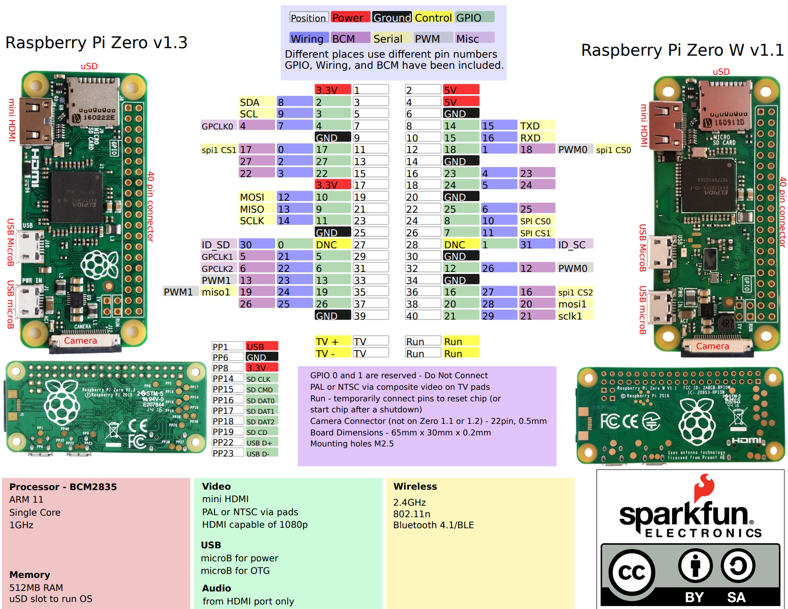

# Double Pulse Generator
## General
Method for Measuring Switching Parameters The standard test method for measuring switching parameters of Si, SiC, and GaN MOSFETs and IGBTs is the double pulse Test (DPT). Double pulse testing can be used to measure energy loss during device turn-on and turn-off, as well as reverse recovery parameters. A good explanation can be found here: https://www.tek.com/en/documents/application-note/double-pulse-test-tektronix-afg31000-arbitrary-function-generator?anv=2
Program runs on an Raspberry Pi Zero as bare metal program (tested on a Pi ZeroW V1.1). Minimum pulsewith = 0,4 micro second, resolution 80nsec. For example: sending JSON {"pulseWidth1": 0} via serial port gives a delay of 0,4 usec + (10*0,08usec) = 1,2usec. For the delay between pulstrains (pulseInterval) the starting delay is 1,5usec. So sending JSON {"pulseInterval": 10} gives 1,5 usec + (10*0,08usec) = 2,3usec.
Connect 
Sending a Json like: {"pulseInterval": 500, "pulseWidth1": 10, "interPulseDelay": 200, "pulseWidth2": 10} via the serial port (115200 baud, n, 8, 1) generates:\
>_____________                    ____________\
>| pulseWidth1 | interPulseDelay | pulseWith2 | pulseInterval\
>     10        ______ 200 ______     10       _____ 500 _____
## Connections
Connect TXD to GPIO 14, 4th pin from the top, most right row. RXD to GPIO 15, 5th pin from the top, most right row. GND to pin 6, 3rd pin from the top, most right row. Output pulses to GPIO 18, , 6th pin from the top, most right row.  

## Thanks to
Software is partly used from Teensy 4.0 Signal Generator, Electronics Workshop, Robin O'Reilly.
For JSON extraction thanks to https://github.com/zserge/jsmn/. 
For starting with the bare metal programming https://github.com/dwelch67/raspberrypi-zero.

## Generating code
Made on a Windows11 machine using:
make: The makefile is made to be used with https://www.gnu.org/software/make/.
compiler: The Compiler used is 'arm-gnu-toolchain-14.2.rel1-mingw-w64-i686-arm-none-eabi.exe' downloaded from https://developer.arm.com/downloads/-/arm-gnu-toolchain-downloads
I had to include the install directories from both in my system variables PATH by hand. Do not know why, and did not spent the time to find out why.
After running 'make' copy kernel.img to an SD. Don't forget to copy bootcode.bin and start.elf. All in the root of the SD card.

## Modifying values via JSON
Included is a .exe file to run on a windows pc to generate a JSON (only to use with this DoublePulse_Tester. Source code can be found on https://github.com/ErikBakker100/JSONGenerator
